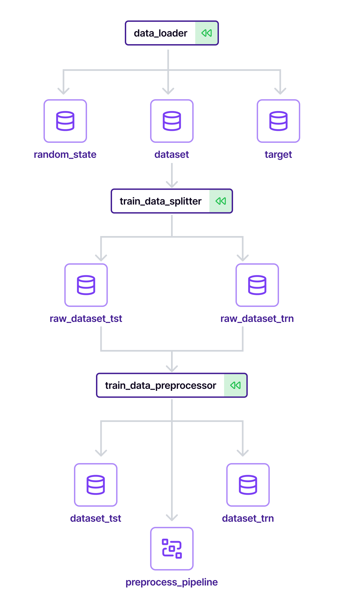
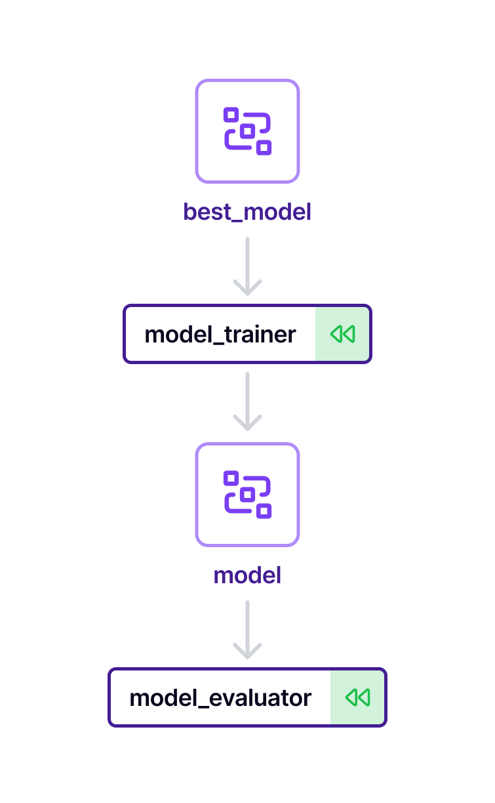

# 💫 ZenML End-to-End Tabular Training with Batch Predictions Project Template

What would you need to get a quick understanding of the ZenML framework and
start building your ML pipelines? The answer is a comprehensive project template
to cover major use cases of ZenML: a collection of steps and pipelines and, 
to top it all off, a simple but useful CLI. This is exactly
what the ZenML templates are all about.

This project template is a great starting point for anyone looking to deepen their knowledge of ZenML.
It consists of two pipelines with the following high-level setup:
<p align="center">
  
</p>

Both pipelines are inside a shared Model Control Plane model context - training pipeline creates and promotes new Model Control Plane version and inference pipeline is reading from inference Model Control Plane version. This makes those pipelines closely connected, while ensuring that only quality assured Model Control Plane versions are used to produce predictions delivered to stakeholders.
* [CT] Training
  * Load, split, and preprocess the training dataset
  * Search for an optimal model object architecture and tune its hyperparameters
  * Train the model object and evaluate its performance on the holdout set
  * Compare a recently trained model object with one promoted earlier
  * If a recently trained model object performs better, then stage it as a new inference model in the Model Control Plane
* [CD] Batch Inference
  * Load the inference dataset and preprocess it reusing object fitted during training
  * Perform data drift analysis reusing training dataset of the inference Model Control Plane version as a reference
  * Run predictions using a model object from the inference Model Control Plane version
  * Store predictions as a versioned artifact and link it to the inference Model Control Plane version

It showcases the core ZenML concepts for supervised ML with batch predictions:

* designing [ZenML pipeline steps](https://docs.zenml.io/user-guide/starter-guide/create-an-ml-pipeline)
* using [step parameterization](https://docs.zenml.io/user-guide/starter-guide/create-an-ml-pipeline#parametrizing-a-step)
 and [step caching](https://docs.zenml.io/user-guide/starter-guide/cache-previous-executions#caching-at-a-step-level)
to design flexible and reusable steps
* using [custom data types for your artifacts and writing materializers for them](https://docs.zenml.io/user-guide/advanced-guide/artifact-management/handle-custom-data-types)
* constructing and running a [ZenML pipeline](https://docs.zenml.io/user-guide/starter-guide/create-an-ml-pipeline)
* usage of ZenML Model Control Plane
* best practices for implementing and running reproducible and reliable ML
pipelines with ZenML

In addition to that, the entire project is implemented with the [scikit-learn](https://scikit-learn.org)
library and showcases how to use ZenML with a popular ML framework. It makes
heavy use of the tabular datasets and classification models that scikit-learn
provides, but the concepts and patterns it showcases apply to any
other ML framework.

## 📃 Template Parameters

| Parameter | Description | Default |
|-----------|-------------|---------|
| Name | The name of the person/entity holding the copyright | ZenML GmbH |
| Email | The email of the person/entity holding the copyright | info@zenml.io |
| Project Name | Short name for your project | ZenML E2E project |
| Project Version | The version of your project | 0.0.1 |
| Project License | The license under which your project will be released (one of `Apache Software License 2.0`, `MIT license`, `BSD license`, `ISC license`, `GNU General Public License v3` and `Not open source`) | Apache Software License 2.0 |
| Technical product name | The technical name to prefix all tech assets (pipelines, models, etc.) | e2e_use_case |
| Target environment | The target environment for deployments/promotions (one of `staging`, `production`) | staging |
| Use hyperparameter tuning | Whether to use hyperparameter tuning or not | yes |
| Use metric-based promotion | Whether to compare metric of interest to make model version promotion | yes |
| Use data quality checks | Whether to use data quality checks based on Evidently report to assess data before inference | yes |
| Notifications on failure | Whether to notify about pipelines failures | yes |
| Notifications on success | Whether to notify about pipelines successes | no |
| Remote ZenML Server URL | Optional URL of a remote ZenML server for support scripts | - |

## 🚀 Generate a ZenML Project

First, to use the templates, you need to have Zenml and its `templates` extras installed: 

```bash
pip install zenml[templates]
```

Now you can generate a project from one of the existing templates by using the `--template` flag with the `zenml init` command:

```bash
zenml init --template <short_name_of_template>
# example: zenml init --template e2e_batch
```

Running the command above will result in input prompts being shown to you. If you would like to rely on default values for the ZenML project template - you can add `--template-with-defaults` to the same command, like this:

```bash
zenml init --template <short_name_of_template> --template-with-defaults
# example: zenml init --template e2e_batch --template-with-defaults
```

## 🧰 How this template is implemented

We will be going section by section diving into implementation details and sharing tips and best practices along this journey.

### [Continuous Training] Training Pipeline
Training pipeline is designed to create a new Model Control Plane version and promote it to inference stage upon successfully passing the quality assurance at the end of the pipeline. This ensures that we always infer only on quality-assured Model Control Plane version and provides a seamless integration of required artifacts of this Model Control Plane version later on inference runs.
This is achieved by providing this configuration in `train_config.yaml` used to configure our pipeline:
```yaml
model_config:
  name: your_product_name
  ...
  create_new_model_version: true
```

### [Continuous Training] Training Pipeline: ETL steps

[📂 Code folder](template/steps/etl/)
<p align="center">
  
</p>

Usually at the very beginning of every training pipeline developers are acquiring data to work with in later stages. In this example, we are using [the Breast Cancer Dataset](https://scikit-learn.org/stable/modules/generated/sklearn.datasets.load_breast_cancer.html) to showcase steps but avoid high computational costs.

The first `data_loader` step is downloading data, which is passed to the `train_data_splitter` step responsible for splitting into train and test to avoid target leakage on data cleaning. The next `train_data_preprocess` step is preparing a `sklearn.Pipeline` object based on the training dataset and applying it also on the testing set to form ready-to-use datasets.

We also output `preprocess_pipeline` as an output artifact from `train_data_preprocess` - it will be passed into the inference pipeline later on, to prepare the inference data using the same fitted pipeline from training. Sklearn `Pipeline` comes really handy to perform consistent repeatable data manipulations on top of pandas `DataFrame` or similar structures.

### [Continuous Training] Training Pipeline: Model architecture search and hyperparameter tuning

[📂 Code folder](template/steps/%7B%25%20if%20hyperparameters_tuning%20%25%7Dhp_tuning%7B%25%20endif%20%25%7D)
<p align="center">
  
</p>

To ensure the high quality of ML models many ML Engineers go for automated hyperparameter tuning or even automated model architecture search. In this example, we are using prepared data from ETL to spin up a search of the best model parameters for different architectures in parallel.

To create parallel processing of computationally expensive operations we use a loop over predefined potential architectures and respective parameters search grid and create one step for each candidate. Inside each hyperparameter tuning step instance, we run random search cross-validation to find the best parameters and after that evaluate the result using the metric of interest (accuracy_score in this example). We attach a computed metric to the output artifact as metadata to be used later in `hp_tuning_select_best_model`.
<details>
  <summary>Code snippet 💻</summary>

```python
from zenml import log_artifact_metadata

score = accuracy_score(y_tst, y_pred)
# log score along with output artifact as metadata
log_artifact_metadata(
    output_name="hp_result",
    metric=float(score),
)
```
</details>

After the steps are executed we need to collect results (one best model per each search step) in a `hp_tuning_select_best_model` step to define the final winner and pass it to training. We use the Model Control Plane capabilities to pull correct artifacts from previous steps and fetch their metadata for final evaluation before actual training.
<details>
  <summary>Code snippet 💻</summary>

```python
from zenml import get_step_context

model_version = get_step_context().model_config._get_model_version()

best_model = None
best_metric = -1
# consume artifacts attached to current model version in Model Control Plane
for full_artifact_name in model_version.artifact_object_ids:
    # if artifacts comes from one of HP tuning steps
    if full_artifact_name.endswith("hp_result"):
        hp_output = model_version.artifacts[full_artifact_name]["1"]
        model: ClassifierMixin = hp_output.load()
        # fetch metadata we attached earlier
        metric = float(hp_output.metadata["metric"].value)
        if best_model is None or best_metric < metric:
            best_model = model
```
</details>


To ensure that collection goes smoothly and in full we use an `after` statement populated with all search steps names, so the selector job will wait for the completion of all searches.


You can find more information about the current state of [Hyperparameter Tuning using ZenML in the documentation](https://docs.zenml.io/user-guide/advanced-guide/pipelining-features/hyper-parameter-tuning).


### [Continuous Training] Training Pipeline: Model training and evaluation

[📂 Code folder](template/steps/training/)
<p align="center">
  
</p>

Having the best model architecture and its hyperparameters defined in the previous section makes it possible to train a quality model object. Also, model training is the right place to bring an [Experiment Tracker](https://docs.zenml.io/stacks-and-components/component-guide/experiment-trackers) into the picture - we will log all metrics and model object itself into the [Experiment Tracker](https://docs.zenml.io/stacks-and-components/component-guide/experiment-trackers), so we can register our model object in a [Model Registry](https://docs.zenml.io/stacks-and-components/component-guide/model-registries) and pass it down to a [Model Deployer](https://docs.zenml.io/stacks-and-components/component-guide/model-deployers) easily and traceable. We will use information from the active stack to make the implementation agnostic of the underlying infrastructure.
To make the most of the Model Control Plane we additionally annotate the output model object as a Model Artifact, and by doing so it will be properly categorized for future use and get additional model object-specific features.
<details>
  <summary>Code snippet 💻</summary>

```python
from zenml.model import ModelArtifactConfig

experiment_tracker = Client().active_stack.experiment_tracker
@step(experiment_tracker=experiment_tracker.name)
def model_trainer(
    ...
) -> Annotated[ClassifierMixin, "model", ModelArtifactConfig()]:
  ...
```
</details>
Even knowing that the hyperparameter tuning step happened we would like to ensure that our model object meets at least minimal quality standards; this quality gate is on the evaluation step. In case the model object is of low quality metric-wise an `Exception` will be raised and the pipeline will stop.

To notify maintainers of our Model Control Plane model about failures or successful completion of a pipeline we use the active stack's [Alerter](https://docs.zenml.io/stacks-and-components/component-guide/alerters) component. For failures it is convenient to use pipeline hook `on_failure` and for successes, a step notifying about it added as a last step of the pipeline comes in handy.
<details>
  <summary>Code snippet 💻</summary>

```python
alerter = Client().active_stack.alerter

def notify_on_failure() -> None:
    alerter.post(message=build_message(status="failed"))

@step(enable_cache=False)
def notify_on_success() -> None:
    alerter.post(message=build_message(status="succeeded"))

@pipeline(on_failure=notify_on_failure)
def e2e_example_training(...):
  ...
  promote_with_metric_compare(...)
  notify_on_success(after=["promote_with_metric_compare"])
```
</details>


### [Continuous Training] Training Pipeline: Model Control Plane version promotion

[📂 Code folder](template/steps/promotion/)
<p align="center">
  
</p>

Once the model object is trained and evaluated on meeting basic quality standards, we would like to understand whether it is good enough to beat the existing model object used in inference. This is a very important step, as promoting a weak model object as inference might have a huge negative impact.

In this example, we are implementing promotion based on metric comparison to decide on the spot and avoid more complex approaches like Champion/Challengers shadow deployments. In other projects, other promotion techniques and strategies can be used.

To achieve this we would retrieve the model version from the Model Control Plane: latest (the one we just trained) and current (the one having a proper tag). Next, we need to deploy both model objects using [Model Deployer](https://docs.zenml.io/stacks-and-components/component-guide/model-deployers) and run predictions on the testing set for both of them. Next, we select which one of the model registry versions has a better metric value. If the newly trained model is performing better we promote it to the inference stage in the Model Control Plane.

By doing so we ensure that the best-performing version will be used for inference later on and ensure seamless integration of relevant artifacts from the training pipeline in the batch inference pipeline.

### [Continuous Deployment] Batch Inference
The Batch Inference pipeline is designed to run with inference Model Control Plane version context. This ensures that we always infer only on quality-assured Model Control Plane version and provide seamless integration of required artifacts created during training of this Model Control Plane version.
This is achieved by providing this configuration in `inference_config.yaml` used to configure our pipeline:
```yaml
model_config:
  name: your_product_name
  version: production
```

<p align="center">
  
</p>

### [Continuous Deployment] Batch Inference: ETL Steps

[📂 Code folder](template/steps/etl)

The process of loading data is similar to training, even the same step function is used, but with the `is_inference` flag.

But inference flow has an important difference - there is no need to fit preprocessing sklearn `Pipeline`, rather we need to reuse one fitted during training on the train set, to ensure that the model object gets the expected input. To do so we will use [ExternalArtifact](https://docs.zenml.io/user-guide/advanced-guide/pipelining-features/configure-steps-pipelines#pass-any-kind-of-data-to-your-steps) with lookup by `model_artifact_name` only to get the preprocessing pipeline fitted during the quality-assured training run. This is possible since we configured the batch inference pipeline to run inside a Model Control Plane version context.
<details>
  <summary>Code snippet 💻</summary>

```python
########## ETL stage  ##########
df_inference, target = data_loader(is_inference=True)
df_inference = inference_data_preprocessor(
    dataset_inf=df_inference,
    preprocess_pipeline=ExternalArtifact(
      model_artifact_name="preprocess_pipeline",
    ), # this fetches artifact using Model Control Plane
    target=target,
)
```
</details>


### [Continuous Deployment] Batch Inference: Drift reporting

[📂 Code folder](template/steps/%7B%25%20if%20data_quality_checks%20%25%7Ddata_quality%7B%25%20endif%20%25%7D)

In the drift reporting stage, we will use [standard step](https://docs.zenml.io/stacks-and-components/component-guide/data-validators/evidently#the-evidently-data-validator) `evidently_report_step` to build Evidently report to assess certain data quality metrics. `evidently_report_step` has a number of options, but for this example, we will build only `DataQualityPreset` metrics preset to get a number of NA values in reference and current datasets.

We pass `dataset_trn` from the training pipeline as a `reference_dataset` here. To do so we will use [ExternalArtifact](https://docs.zenml.io/user-guide/advanced-guide/pipelining-features/configure-steps-pipelines#pass-any-kind-of-data-to-your-steps) with lookup by `model_artifact_name` only to get the training dataset used during quality-assured training run. This is possible since we configured the batch inference pipeline to run inside a Model Control Plane version context.

After the report is built we execute another quality gate using the `drift_quality_gate` step, which assesses if a significant drift in the NA count is observed. If so, execution is stopped with an exception.

You can follow [Data Validators docs](https://docs.zenml.io/stacks-and-components/component-guide/data-validators) to get more inspiration on how and when to use drift detection in your pipelines.

### [Continuous Deployment] Batch Inference: Inference

[📂 Code folder](template/steps/inference)

As a last step concluding all work done so far, we will calculate predictions on the inference dataset and persist them in [Artifact Store](https://docs.zenml.io/stacks-and-components/component-guide/artifact-stores) attached to the current inference model version of the Model Control Plane for reuse and observability.

We will leverage metadata of `model` artifact linked to the inference model version of the Model Control Plane to create a deployment service and run `.predict()` to put those predictions as an output of the predictions step, so it is automatically stored in the [Artifact Store](https://docs.zenml.io/stacks-and-components/component-guide/artifact-stores) and linked to the Model Control Plane model version as a versioned artifact link with zero effort. This is achieved because we additionally annotated the `predictions` output with `ArtifactConfig(overwrite=False)`. This is required to deliver a comprehensive history to stakeholders since Batch Inference can be executed using the same Model Control Plane version multiple times.
<details>
  <summary>Code snippet 💻</summary>

```python
from zenml.model import ArtifactConfig

@step
def inference_predict(
    deployment_service: MLFlowDeploymentService,
    dataset_inf: pd.DataFrame,
) -> Annotated[pd.Series, "predictions", ArtifactConfig(overwrite=False)]:
    predictions = deployment_service.predict(request=dataset_inf)
    predictions = pd.Series(predictions, name="predicted")
    return predictions
```
</details>
